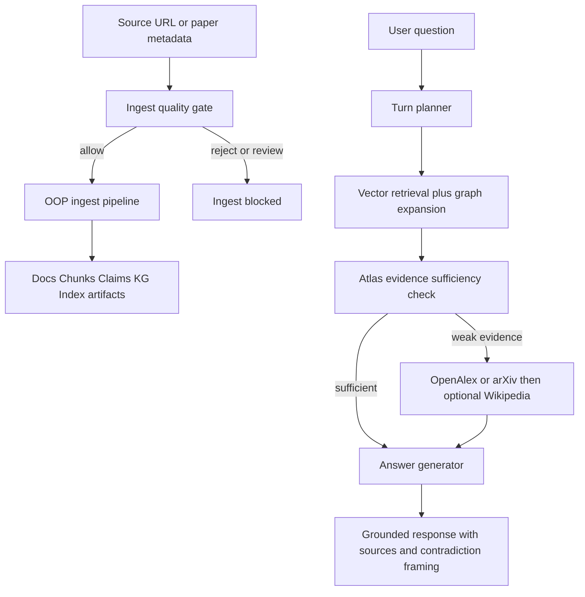

# Alignment Atlas

Alignment Atlas is an end-to-end GraphRAG research assistant for AI alignment and safety literature.
It ingests papers/posts, extracts structured claims, builds a claim-centric knowledge graph, retrieves evidence for user questions, and generates grounded answers with citations.

## What This Codebase Does

- Ingests source documents (PDF/HTML) from a paper manifest.
- Converts sources to normalized text and section-aware chunks.
- Adds chunk neighbor links and embedding indexes for semantic retrieval.
- Extracts atomic claims from chunks using OpenAI structured outputs.
- Builds a claim-centric knowledge graph and optionally adds NLI-style claim relations (entails / contradiction / neutral).
- Serves a chat app (Streamlit/Gradio/FastAPI) that retrieves evidence and generates grounded answers.
- Uses a model-planned turn strategy so the model can choose retrieval depth and answer style per user request.

## High-Level Architecture

1) **Data ingestion pipeline (`src/ingest/`)**
- Stage 00: materialize manifest and download sources
- Stage 01: convert source files to text
- Stage 02/03: chunk + neighbor + embeddings
- Stage 04: claim extraction
- Stage 05/06/07: KG construction + relation detection + merge

2) **Retrieval + answer generation (`src/retrieval/`)**
- Vector retrieval over chunk embeddings
- Claim and relation expansion from KG
- Final answer generation with OpenAI structured outputs and citations

3) **Application layer (`src/app/`)**
- Chat orchestration, ingest jobs, progress reporting
- Streamlit and Gradio/FastAPI frontends
- Citation resolver and optional storage sync backend

## OOP Ingest Modules

Ingest execution is organized into three OOP modules:

- `src/ingest/stages.py`
  - `ModuleStage` + `StageResult` wrappers for stage execution.
- `src/ingest/pipeline.py`
  - `IngestPipeline` orchestrator for full runs and single-stage execution.
- `src/ingest/cli.py`
  - Unified CLI entrypoint for reingest, single URL ingest, and stage debugging.

## How GraphRAG Is Implemented Here

This project combines **vector retrieval** + **graph expansion** + **LLM synthesis**:

1. **Graph construction (offline ingest):**
   - Claims become graph nodes (`build_kg` stage in `src/ingest/stages.py`)
   - Optional relation stage adds `entails` / `contradiction` claim edges (`detect_contradictions` stage in `src/ingest/stages.py`)
   - Final merged graph is written as `graph_with_relations.*`

2. **Graph-aware retrieval at runtime:**
   - Retrieve top semantic chunks from embedding index
   - Expand neighbor chunks by radius
   - Pull claim nodes attached to retrieved chunks
   - Expand claim relations (especially contradiction edges) to surface cross-paper tensions
   - This is orchestrated in `src/retrieval/retriever.py` and `src/app/chat_agent.py`

3. **Grounded answer generation:**
   - `src/retrieval/generate_answer_openai.py` builds an evidence digest
   - Model must return structured JSON (schema-constrained)
   - Citations are normalized and resolved to user-facing sources by `src/retrieval/citations.py`

## End-to-End Pipeline (Detailed)

Input manifest:
- `data/papers.jsonl` can now contain minimal rows with only:
  - `{"source_url": "https://..."}`
- In Stage 00, the pipeline infers `doc_id`, `title`, `year` (when possible), and `source_type` from URL.

### Stage 00A: Collect manifest
`src/ingest/00_collect_papers_manifest.py`
- Reads `data/papers.jsonl`
- Writes `data/processed/docs.jsonl` with normalized metadata and expected local source paths

### Stage 00B: Download source files
`src/ingest/00_download_sources.py`
- Downloads PDF/HTML to:
  - `data/raw_pdfs/{doc_id}.pdf`
  - `data/raw_html/{doc_id}.html`

### Stage 00C: Optional manifest dedupe (recommended once)
`dedupe_manifest` stage (`src/ingest/stages.py`)
- Canonicalizes URLs, collapses duplicate papers by URL identity, and normalizes title fields.
- Useful if the same paper was added multiple times with different title casing/URL variants.

Run dry-run:
```bash
python -m src.ingest.cli run-stage --stage dedupe_manifest
```

Apply changes:
```bash
INGEST_DEDUPE_APPLY=1 python -m src.ingest.cli run-stage --stage dedupe_manifest
```

### Stage 00D: Full reingest (CLI)
`python -m src.ingest.cli reingest`
- Supports clean rebuild of processed/index artifacts and optional raw cache wipe.

Examples:
```bash
# Clean rebuild, keep raw downloads cache
python -m src.ingest.cli reingest --clean

# Clean rebuild and re-download raw sources
python -m src.ingest.cli reingest --clean --wipe-raw

# Clean rebuild without relation stages
python -m src.ingest.cli reingest --clean --skip-relations
```

### Stage 01: Source -> text
- PDF path: `pdf_to_text` stage (`src/ingest/stages.py`)
  - Uses GROBID for section-aware parsing (required by default)
  - Optional fallback to `pypdf` only if `GROBID_REQUIRED=0`
  - Writes `data/processed/text/{doc_id}.txt`
  - Optionally writes structured section sidecar under `data/processed/sections/`
- HTML path: `html_to_text` stage (`src/ingest/stages.py`)
  - Cleans HTML and emits plain text to `data/processed/text/{doc_id}.txt`

### Stage 02: Section-aware chunking
`section_chunk` stage (`src/ingest/stages.py`)
- Reads processed text files
- Splits into sections and semantic chunks (no overlap)
- Writes `data/processed/chunks.jsonl`

### Stage 03: Neighbor links and embeddings
- `apply_neighbors` stage: writes chunk neighbor-enriched JSONL
- `embed_chunks` + `export_chunk_embs` stages:
  - Builds embedding artifacts:
    - `data/indexes/chunk_embs.npy`
    - `data/indexes/chunk_meta.jsonl`
    - `data/indexes/chunk_row_ids.json`

### Stage 04: Claim extraction (OpenAI)
`extract_claims` stage (`src/ingest/stages.py`)
- Reads chunks
- Uses OpenAI Responses API + JSON schema to extract claim objects
- Writes:
  - `data/processed/claims.jsonl`
  - per-chunk cache under `data/processed/cache/claims_by_chunk/`

### Stage 05: Build knowledge graph
`build_kg` stage (`src/ingest/stages.py`)
- Builds graph with paper, claim, and tag nodes
- Writes:
  - `data/processed/kg/graph.graphml`
  - `data/processed/kg/graph.json`

### Stage 06: Detect claim relations (OpenAI NLI-style)
`detect_contradictions` stage (`src/ingest/stages.py`)
- Generates candidate claim pairs via local embedding similarity
- Uses OpenAI structured classification for `entails | contradiction | neutral`
- Writes:
  - `data/processed/relations.jsonl`
  - per-pair cache under `data/processed/cache/relations_by_pair/`

### Stage 07: Merge relations into KG
`merge_relations_into_kg` stage (`src/ingest/stages.py`)
- Merges relation edges into the final graph
- Produces `graph_with_relations` artifacts used at runtime

## Runtime Q&A Flow

Primary files:
- `src/app/chat_agent.py`
- `src/retrieval/retriever.py`
- `src/retrieval/generate_answer_openai.py`
- `src/retrieval/citations.py`

For each user message:
1. **Turn planning (LLM):**
   - Rewrites follow-up to standalone query
   - Chooses `answer_mode` (`strict`, `balanced`, `expansive`)
   - Chooses tool/retrieval plan (`focused`, `standard`, `deep`) and fallback preference
2. **Evidence retrieval:**
   - Vector retrieval over chunk embeddings
   - Neighbor expansion
   - Claim + relation expansion from KG
3. **Evidence sufficiency check + optional external fallback:**
   - `chat_agent._should_use_external_fallback(...)` computes Atlas evidence quality from:
     - top chunk similarity score
     - mean top-3 chunk score
     - number of retrieved chunks
     - number of retrieved claims
   - If evidence is weak (score and/or structure thresholds), fallback can trigger
   - Planner can also force behavior via tool plan:
     - `external_fallback_preference = avoid|auto|prefer`
   - External retrieval uses:
     - OpenAlex + arXiv (scholarly-first)
     - Wikipedia only if scholarly coverage is insufficient
     - Implemented in `src/retrieval/external_fallback.py`
4. **Answer generation (LLM):**
   - Produces structured Britannica-style output with citations
   - Uses full evidence text in digest (no aggressive chunk/claim trimming)
   - Can use LaTeX in output only when equation-like notation appears in cited evidence

## Current Design Choices

- Claim extraction stays concise/atomic for retrieval + KG quality.
- Hard caps on evidence item counts are kept to control cost/latency.
- Context text sent to final answer stage is not aggressively shortened.
- The model (not hardcoded rules) plans answer depth and retrieval profile each turn.

## How Responses Are Tailored To User Goals

Tailoring happens in two layers:

1. **UI intent selection (Streamlit):**
   - "What are you here to learn?" changes suggested starter questions by user goal
   - "How should answers be framed?" maps to steering modes:
     - `safety_first`
     - `interpretability_first`
     - `practical_deployment`

2. **Chat agent steering profile (`chat_agent.steering_profile`):**
   - Converts user framing into tone/emphasis/citation strictness
   - Passed to both planner and generator:
     - planner decides retrieval depth + fallback preference
     - generator adapts explanation style while staying citation-grounded

Net effect: users can ask the same topic but get differently framed answers (risk-focused vs mechanistic vs operational) without changing factual grounding.

## GraphRAG + Ingest Flow Diagram



## Ingest Guardrails (Quality Gate)

Ingest is blocked unless quality decision is `allow`.

- Candidate evaluation: `src/app/ingest_guardrails.py`
  - LLM tiering (`highly_relevant` / `somewhat_relevant` / `unrelated`)
  - Decision (`allow` / `review` / `reject`)
  - Semantic Scholar signals (citations, venue, metadata)
  - Trusted-domain checks
- UI and backend both enforce:
  - valid `http(s)` source URL required
  - non-`allow` submissions do not start ingest jobs

## Running the Project

## 1) Install

This project uses `pyproject.toml` (Python >= 3.11).

```bash
uv sync
```

or with pip:

```bash
pip install -e .
```

## 2) Set environment

Required:

```bash
export OPENAI_API_KEY="your_key_here"
```

Optional common vars:
- `CLAIMS_MODEL` (Stage 04 model)
- `RELATIONS_MODEL` (Stage 06 model)
- `ANSWER_MODEL` / `REWRITE_MODEL` (chat generation + planning)
- `GROBID_URL` (for better PDF structure extraction)
- `ATLAS_FALLBACK_MIN_TOP_SCORE` / `ATLAS_FALLBACK_MIN_MEAN_TOP3` (external fallback score thresholds)
- `ATLAS_FALLBACK_MIN_CHUNKS` / `ATLAS_FALLBACK_MIN_CLAIMS` (minimum Atlas evidence coverage before fallback)
- `GROBID_REQUIRED=1|0` (require GROBID vs permit pypdf fallback)

## 3) Run app

Streamlit:

```bash
streamlit run app.py
```

Gradio/FastAPI app:

```bash
uvicorn src.app.web_app:app --reload
```

## 4) Run ingest pipeline manually

```bash
# Full ingest (with relations)
python -m src.ingest.cli reingest

# Full ingest without relation stages
python -m src.ingest.cli reingest --skip-relations

# Single-source ingest through Atlas service path
python -m src.ingest.cli ingest-url --url "https://arxiv.org/pdf/2209.13085"

# Run one stage for debugging
python -m src.ingest.cli run-stage --stage "build_kg"
```

In the app, ingest is usually triggered via `AtlasService.ingest_source(...)`, which supports incremental mode and job progress tracking.

## Project Layout

- `app.py` - Streamlit entrypoint
- `src/ingest/` - offline data pipeline
- `src/retrieval/` - retrieval, citations, answer generation
- `src/app/` - orchestration, UI, APIs, storage sync
- `data/` - manifest, raw sources, processed artifacts, indexes
- `tests/` - test suite

## Notes / Limitations

- PDF extraction quality depends on source quality and parser quality.
- External fallback is intended as a backup when atlas evidence is weak.
- Relation detection quality depends on both candidate pair prefiltering and NLI-style classification.
- Costs/latency are dominated by OpenAI calls in claim extraction, relation detection, and answer generation.
